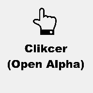

# Clikcer
### A PC/Mobile/VR port of Clikcer

## The Code.org game now makes its way onto PC, Mobile and VR! Enjoy a laid-back clicking experience to become the richest Clikcer you know.
* Achievements
* Upgrades
* Multipliers
* and a whole lot of clicking

## Supported Platforms:
* Linux/X11
* macOS [How to run the game.](https://docs.godotengine.org/en/3.5/tutorials/export/running_on_macos.html?highlight=macOS#app-is-signed-including-ad-hoc-signatures-but-not-notarized)
* Windows
* Android [How to Install](https://github.com/Blockyheadman/Clikcer/wiki/How-to-install-on..#how-to-install-on-android)
* Meta Quest 1/2/Pro [Head to ClikcerVR Instead](https://github.com/Blockyheadman/ClikcerVR)

### Project License
*This project uses a [GNU v3](https://choosealicense.com/licenses/gpl-3.0/) license.*
